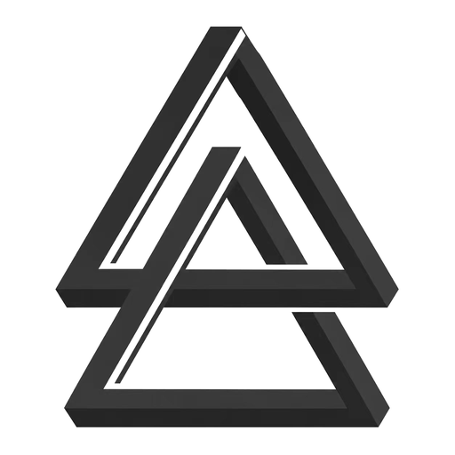
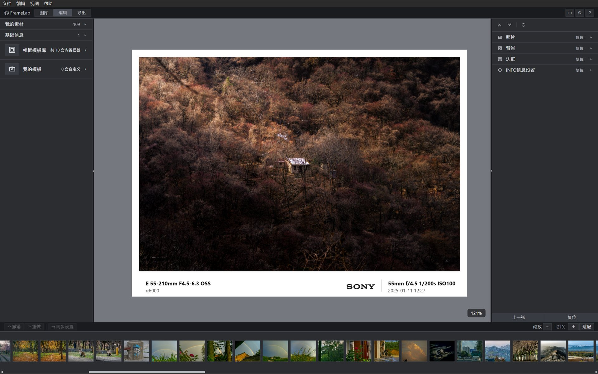

<div align="center">



# 水印小屋

本定制版本作者与维护者：**风喃（fengnan）**。安卓当前名称为“水印小屋”，沿用原包名与签名覆盖升级。

安卓安装包由本仓库 [Releases](https://github.com/xiangyizhang-hue/watermark-house/releases) 发布；当前本地交付版为 0.3.8。来源和兼容性说明见 [BRANDING.md](BRANDING.md)。

后续版本发布与覆盖升级步骤见 [安卓更新发布说明](docs/android/GITHUB_RELEASE.md)。

**为照片添加可编辑水印、品牌 Logo 和 EXIF 参数的本地工具**

杂志模板 · 原图导出 · 照片本地处理

[](https://github.com/xiangyizhang-hue/watermark-house/releases/latest)


[**⬇ 下载发布版**](https://github.com/xiangyizhang-hue/watermark-house/releases/latest) · [💬 问题反馈](https://github.com/xiangyizhang-hue/watermark-house/issues/new)

</div>

---

<div align="center">

</div>

## ✨ 功能特性

### 相框与排版

- **多种 INFO 布局**：经典纵向 / 杂志双栏 / 悬浮双行 / 手机白底水印卡 / 杂志编辑（顶部标题 + 照片自动取色色卡）
- **品牌 Logo**：佳能 / 索尼 / 尼康 / 富士 / 哈苏 / 徕卡等相机品牌与小米 / 华为 / 三星 / iPhone 等手机品牌的官方矢量字标，暗白双版自动适配，支持自定义颜色
- **自定义 Logo**：上传图片（IndexedDB 持久化），或直接输入文字生成文字标
- **背景模式**：原图模糊铺满 / 纯色 / 自定义图片；边框宽度、下边加宽、圆角、立体阴影、画面比例（16:9 / 4:3 / 1:1…）均可调
- **相框模板库**：10 套内置模板 + 自定义模板（当前照片实时合成预览、批量应用、重命名、导入导出 JSON）
- **附加效果**：暗角、颗粒、文本 / 图片水印（单枚或平铺）

### 信息与 EXIF

- **自动识别**：导入照片自动解析 EXIF（焦距 / 光圈 / 快门 / ISO / 镜头 / 拍摄日期 / 机身型号），型号自动映射为营销名（如 ILCE-6000 → α6000）
- **灵活控制**：EXIF / 镜头 / 日期 / 型号 / Logo 各自独立开关、字体、字号、颜色，支持画布自由拖拽定位与居中吸附
- **等效焦距**：优先读取 35mm 字段，或按画幅系数手动换算

### 工作流（对标 Lightroom Classic）

- **图库 → 编辑 → 导出** 三段式：文件夹 / 拖拽批量导入、胶片条切换（← / →）、每张照片独立参数与历史
- **撤销 / 重做** 常驻底栏（Ctrl+Z / Ctrl+Shift+Z），每张照片独立历史链
- **同步设置**：调好一张，一键把相框 / 背景 / INFO 样式同步到多选的其他照片（各照片保留自身 EXIF）
- **批量导出**：选中照片批量出图、逐张回填自身 EXIF、文本映射规则、导出前体积预估
- **自由编辑**：照片任意角度旋转（拉直地平线）、裁剪、缩放平移、Before/After 对比

### 导出画质

- 主照片以**原生像素 1:1** 参与合成，装饰层按比例放大 —— 无降采样、无画质损失
- **PNG 无损 / JPG 高画质（质量可调）** 双格式，超采样让文字与 Logo 更锐利
- 自动嵌入 sRGB ICC Profile，避免偏色

## 📥 下载安装

前往 [**Releases 最新版**](https://github.com/xiangyizhang-hue/watermark-house/releases/latest) 下载安卓 arm64 APK。保持现有包名、签名并递增版本码即可覆盖升级、保留数据。Windows 桌面版如另行发布，也从本仓库下载。

- ✅ **离线可用**：照片和编辑记录在本地处理，无需账号
- ✅ **覆盖升级**：安卓升级不要先卸载旧版；只安装本仓库同签名的新版 APK
- ℹ️ Git 管理源码版本，GitHub Releases 分发 APK；安卓端目前不支持应用内自动安装更新

> 不要从上游 FrameLabdesktop 的 Releases 下载水印小屋；两者不是同一发布渠道。

## 🚀 快速上手

1. **图库**：拖入照片或选择文件夹（支持 JPG / PNG / WebP / GIF / BMP / AVIF；HEIC / RAW 请先转格式）
2. **编辑**：右侧面板调参数，画布上直接拖拽照片与信息元素；滚轮缩放、双击放大、Esc 复位视图
3. **导出**：勾选照片批量导出，或单张即改即出

常用快捷键：`←` `→` 切换照片 · `Ctrl+Z` / `Ctrl+Shift+Z` 撤销重做 · `Ctrl+E` 转到导出 · `Delete` 移除照片

## 🔒 隐私

照片处理在设备本地完成。访问 GitHub 发布页或检查桌面版更新时需要网络；照片不会因此上传。

## 🛠 开发

技术栈：**Tauri 2（Rust）+ Vue 3（`<script setup>` + TypeScript）+ Vite + 原生 Canvas + exifr**

```bash
npm install          # 安装依赖
npm run dev          # 网页端开发（http://localhost:5180）
npm run tauri:dev    # 桌面端开发
npm test             # Vitest 单元测试
npm run tauri:build  # 打包桌面端（Windows 产出 NSIS 安装包）
```

目录结构：

```
src/
  core/          纯逻辑层（导出合成 / INFO 排版 / EXIF 文本规则 / 模板缩略图…，附单元测试）
  composables/   Vue 组合式状态（frameConfig 单一数据源 / 图库 / 历史 / 模板 / Logo 库…）
  components/    layout 五区外壳 · preview 预览链 · controls 参数面板 · common 通用控件
  platform/      Web / Tauri 双端适配层（文件、对话框、目录、GPU 偏好）
src-tauri/       Rust 薄壳（文件与目录 IPC、原生菜单、自动更新）
website/         宣传下载页（Cloudflare Pages 部署，内嵌网页版在线体验）
docs/            项目规划与设计文档
```

> macOS：构建配置已就绪（`app` / `dmg` 目标），需在 macOS 环境执行 `npm run tauri:build`；自动更新依赖 Apple 代码签名，暂未启用。

## 💬 反馈

水印小屋由风喃（fengnan）维护，问题与建议请在[本仓库 Issues](https://github.com/xiangyizhang-hue/watermark-house/issues)反馈。不使用上游作者邮箱接收本定制版反馈。
